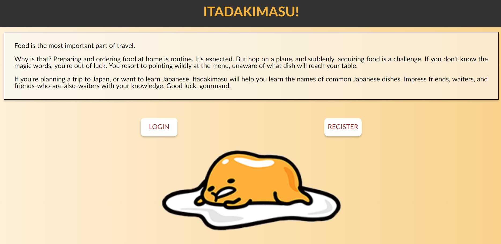
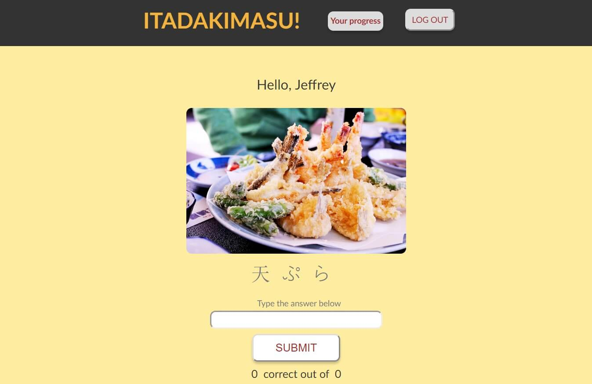
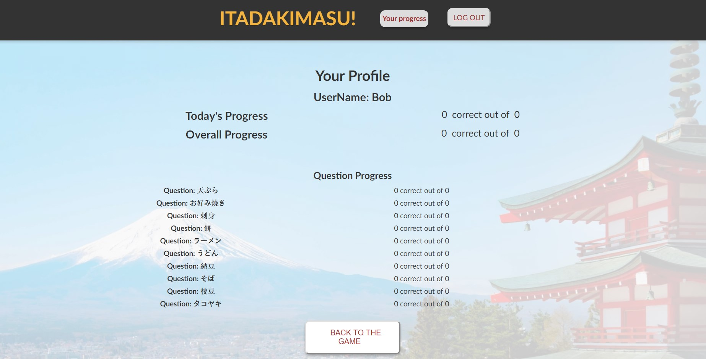

# Itadakimasu!

## Introduction
Food is the most important part of travel.

Why is that? Preparing and ordering food at home is routine. It's expected. But hop on a plane, and suddenly, acquiring food is a challenge. If you don't know the magic words, you're out of luck. You resort to pointing wildly at the menu, unaware of what dish will reach your table.

If you're planning a trip to Japan, or want to learn Japanese, Itadakimasu will help you learn the names of common Japanese dishes. Impress friends, waiters, and friends-who-are-also-waiters with your knowledge. Good luck, gourmand.

## What is spaced repetition?
Spaced repetition is a learning technique that has found mainstream success in a wide variety of learning applications. This technique is perfect for language learning, which requires students to learn a large number of items and retain them indefinitely in memory. As you encounter pieces of information more and more, the less often you need to refresh your memory of it. 

## Start Learning
Don't want to register? Here's a demo user and password:

username: demo

password: demoUser1234

Check out the application [here](https://mighty-cove-75413.herokuapp.com/).

## Screenshots 

## Key Parts of Project
At the core of this application is the spaced repetition algorithm. We've written our code so that as the user answers questions, we dynamically update the sequence of incoming questions to optimize their learning experience. Questions the user answers incorrectly appear more frequently. We hold off on displaying words the user has committed to memory. Implementation of this algorithm can be found in the server side repo:
  /routes/question.js
  
  
As the user answers questions, we thought it might be pragmatic to provide statistics about how they're progressing through the question set. For each session we display the number of questions the user has correctly answered out of the total questions asked. We allow the user access to more detailed statistics on their profile page, where they can compare their current session's data against their overall progress, and view analytics for each specific question. The following code can be found in the client side repo:
  /src/components/profile-page.js

The server side code for this project is [here](https://github.com/thinkful-ei23/itadakimasu-server).

## Tech Stack

### MERN
* MongoDB
* Express.js
* React
* Node.js

### Client-side dependencies
* redux
* redux-form
* react-router
* react-redux

### Server-side dependencies
* cors
* passport
* mongoose
* jwt

## API Documentation

[Click to view API Documentation](https://documenter.getpostman.com/view/4934035/Rzfdoq9v)

## License
[GNU General Public License v3.0](https://choosealicense.com/licenses/gpl-3.0/)
